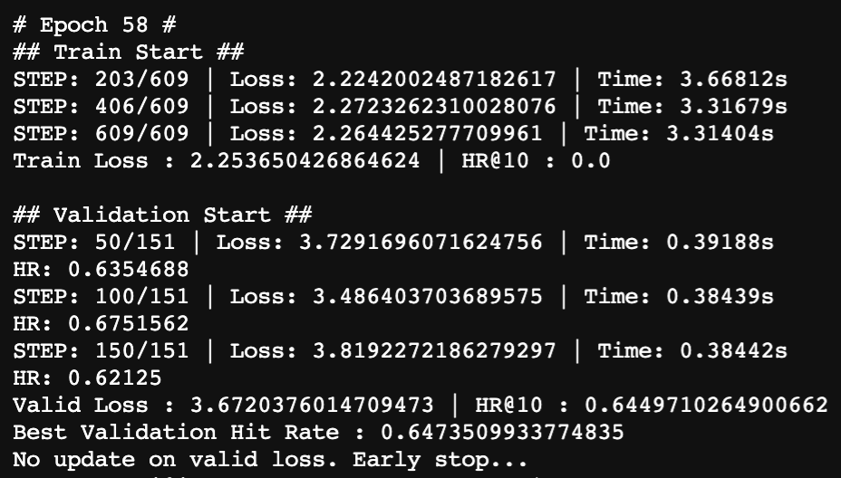

# BERT4Rec for MovieLens 1M
Bert4rec: Sequential recommendation with bidirectional encoder representations from transformer 

 

## Code
Entry file
- run.py

 

## Data Preprocessing
Using MovieLens 1M dataset  

 

## Result
